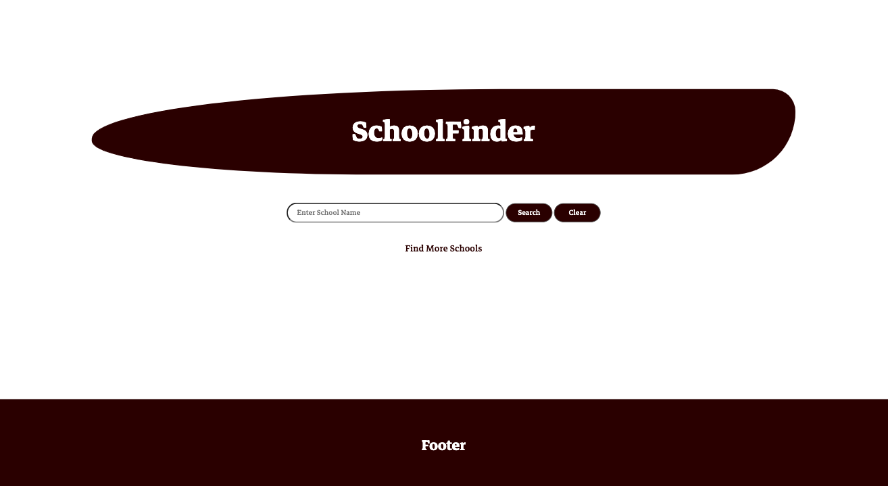
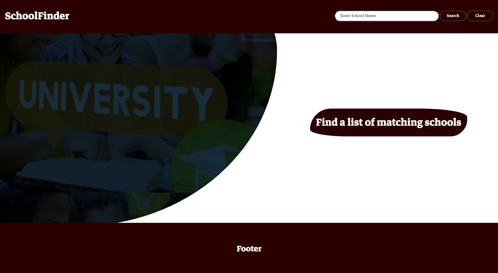
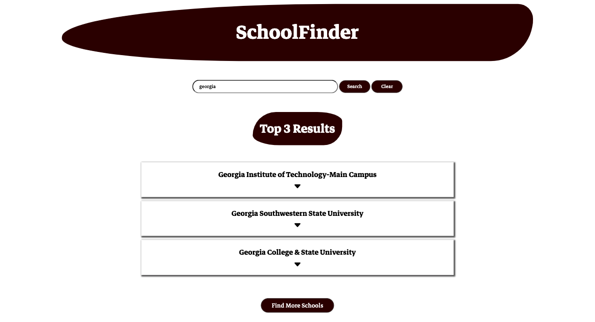
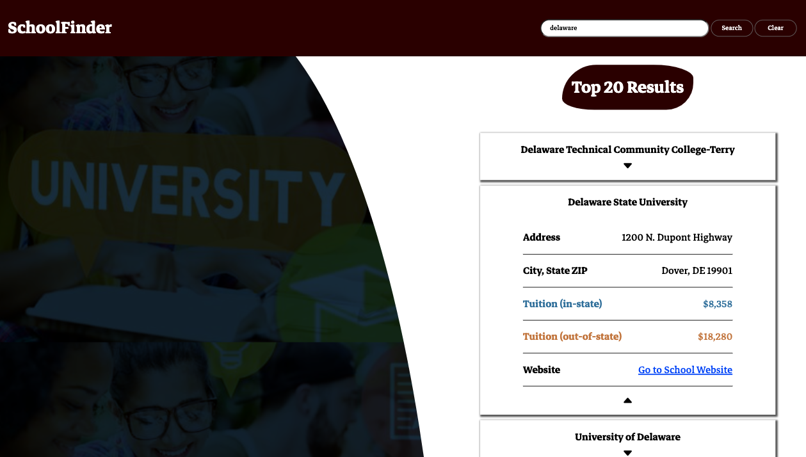

<h1 align="center">SchoolFinder</h1>

<!-- SCREENSHOT -->

  
  

  
  

## Built With

  

## About This Project

This is a mini project built using the U.S. DOE [College Scorecard API](https://collegescorecard.ed.gov/data/api/). I removed some functionality to create a second repository [HTML + CSS + JavaScript(Client-Side): Using Fetch with JSON Data](https://github.com/RjayBrown/javascript-fetch-json-data) for others to review and get hands-on practice working with public API's. 
